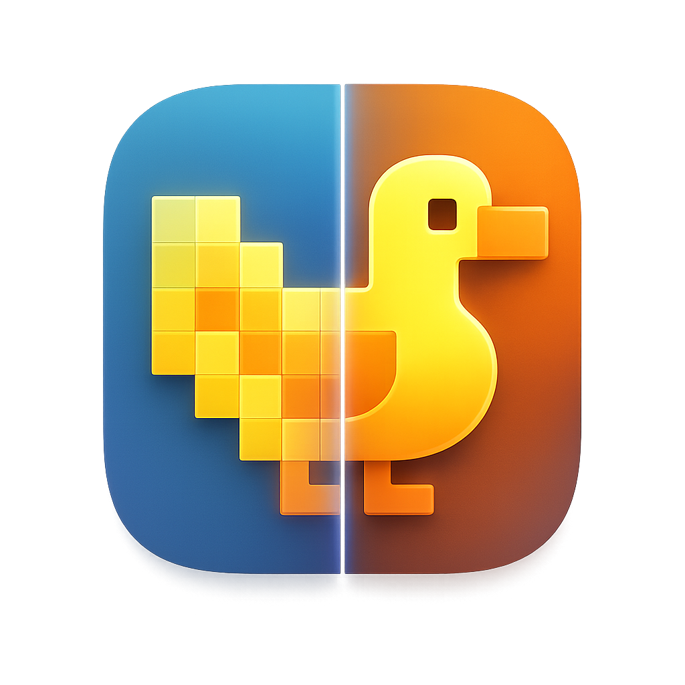

<p align="center">
  
</p>

<h1 align="center">MetalDuck</h1>

<p align="center">
  <strong>The premium frame generation and upscaling harness for macOS.</strong>
</p>

<p align="center">
  
  
  
</p>

---

MetalDuck is a professional-grade tool designed to enhance your macOS gaming and media experience. Utilizing advanced MetalFX upscaling and optical-flow frame generation, it provides a seamless bridge between raw performance and visual excellence.

> [!TIP]
> For the best experience, ensure your Mac is running macOS 15.0 or later to take full advantage of the latest MetalFX features.

## ✨ Features

- **🚀 Professional Upscaling**: Integrated MetalFX spatial upscaler for crisp visuals at lower performance costs.
- **🪄 Frame Generation**: Smooth out low-framerate content with high-accuracy optical-flow frame interpolation.
- **📊 Real-time HUD**: Monitor Your `SOURCE`, `CAP`, `GEN`, and `OUT` FPS in real-time.
- **💾 Profile System**: Create, rename, and manage custom profiles for different games and applications.
- **⚡ Performance Controls**: Fine-tune capture FPS, target FPS, sharpness, and dynamic resolution on the fly.
- **📦 Reliable Installer**: Standard macOS DMG installer with a clean, background-less layout.

## 🛠 Requirements

- **Silicon**: Apple Silicon Mac (M1 or later)
- **Software**: macOS 15.0+
- **Developer Tools**: Xcode 16+ or Command Line Tools with macOS 15+ SDK

## 🚀 Getting Started

### Build from Source

```bash
# Clone the repository
git clone https://github.com/S0N59/MetalDuck.git
cd MetalDuck-main

# Build the release binary
swift build -c release
```

### Run

```bash
# Launch the application
.build/release/MetalDuck
```

## 📂 Project Structure

- `Sources/MetalDuck/App`: App lifecycle and Control UI.
- `Sources/MetalDuck/Capture`: ScreenCaptureKit integration.
- `Sources/MetalDuck/Rendering`: Main render loop and presentation.
- `Sources/MetalDuck/Upscaling`: MetalFX spatial upscaler wrapper.
- `Sources/MetalDuck/FrameGeneration`: Optical-flow FG engine.

## 📄 License

This project is licensed under the **MIT License**. See [LICENSE](LICENSE) for details.

---

<p align="center">
  Made with ❤️ for the macOS community.
</p>
